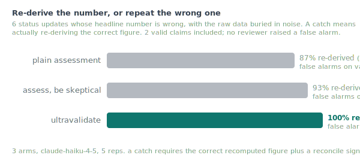
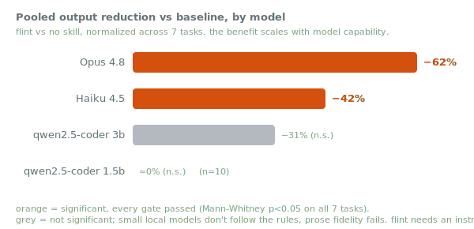

# ultravalidate

**A Claude Code skill that adversarially validates a claim before you trust it.**

Green tests, "it ran", "it compiled" is *build* rigor. It tells you nothing about whether the number
means what you said, the comparison was fair, or the conclusion follows. ultravalidate is the
counterpart: before you report any result, number, comparison, or PR claim, it tries to **refute**
it, reconciles it against the raw source, hunts the confound, and reports the weakest claim the
evidence actually licenses.

The one rule: **refute, do not confirm. Under-claim by default.** A claim survives only by surviving
attack.

The five checks, manifesto-style: **<https://refute-dont-confirm.netlify.app>**

## Install

```bash
# as a Claude Code plugin
/plugin marketplace add jah2488/ultravalidate
/plugin install ultravalidate@ultravalidate

# or as a plain skill
git clone https://github.com/jah2488/ultravalidate ~/ultravalidate
ln -s ~/ultravalidate/skills/ultravalidate ~/.claude/skills/ultravalidate
```

Then `/ultravalidate <claim>` before you trust a result.

## The five checks (every claim, every time)

1. **Reconcile from source.** Recompute the number from the rawest data on disk, never a derived
   summary, never your own prior prose.
2. **Fairness.** Same conditions, budget, inputs, and n across everything compared. Name what differed.
3. **Power.** What is n? One sample is exploratory, not a finding. Did it clear a significance gate?
4. **Confound.** What else could produce this besides the stated cause? Default to "there is a
   confound" until the obvious ones are ruled out.
5. **Falsifier.** What experiment would DISPROVE this, and has it run? If not, the claim is unproven.

## The verdict vocabulary

Every verdict ships with a plain gloss, so a reader never has to decode jargon:

| verdict | what it means |
|---------|---------------|
| **supported** | the evidence holds up under attack |
| **exploratory-only** | an early signal, too little data to conclude |
| **confounded** | something else could explain the result, so the comparison does not prove the claimed cause (name the something else) |
| **unproven** | the experiment that would prove it has not been run |
| **refuted** | the evidence points the other way |

## Worked case study: validating flint's benchmarks

ultravalidate does not produce a score. It produces honest claims. The clearest demonstration is the
benchmark suite for [flint](https://github.com/jah2488/flint), where every number went through these
five checks, which is *why* it carries significance tests, confidence intervals, disclosed confounds,
and labeled negatives instead of round, confident wins.

**Power, made to clear a gate.** The headline was not reported until n reached 20 and a Mann-Whitney
test put every task below p < 0.05 (six of seven below 1e-6), with 95% CIs that exclude zero. An
earlier n=5 number was labeled exploratory until then.

<p align="center">
  
</p>

**Confound, disclosed not hidden.** The harness could not strip the operator's `CLAUDE.md` from the
baseline, so the baseline is a *strong* one and the measured gap is a conservative lower bound, stated
plainly. And the small-model arms are marked **not significant** (grey), because their apparent
reductions are partly degenerate (the answers fail a fidelity floor). They are not counted as wins.

<p align="center">
  
</p>

**Falsifier, run to the breaking point.** Pushing compression past the safe setting (the experimental
`feral` level) was kept *because* it shows where the claim fails: output keeps shrinking, but the
correctness and fidelity gate drops to 77%. A claim of "free compression" is falsified exactly there,
and the chart says so.

<p align="center">
  
</p>

**Reconcile from source.** Every cell above is recomputed from the rawest per-record data by a
hand-rolled stats script (Mann-Whitney U + bootstrap CIs), not from a summary, so the charts and the
prose cannot drift from the data. **Fairness:** same model, prompt, base, and n across arms; only the
skill text differs.

And the smallest worked example, on a claim with no benchmark at all. Given "the new cache cut p99
40%", ultravalidate answers: "**Verdict: confounded** (a load drop happened in the same window, so
the 40% cannot be credited to the cache). Weakest defensible restatement: p99 fell ~40% over a window
that also saw lower load; the cache's contribution is unproven until an equal-load A/B runs."

## Lineage

ultravalidate is one of four disciplines fused into [flint](https://github.com/jah2488/flint), where
the reflex runs before every reported result. The charts above are flint's measured outputs, shown
here as the discipline applied; their full methodology and caveats live in
[flint's benchmarks](https://github.com/jah2488/flint/tree/main/benchmarks). MIT licensed.
